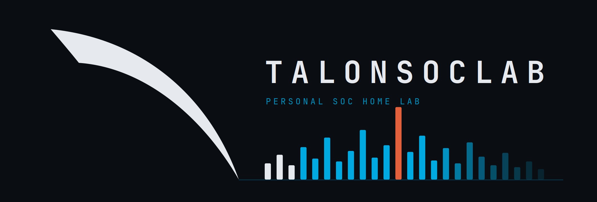

## Status

| Phase | Deliverable | |
|---|---|:---:|
| **A — Foundation SOC Stack** | Wazuh + Sysmon + Suricata, real-device agents, custom dashboards | 🚧 |
| **B — Detection Engineering** | Sigma rule pack validated against MITRE ATT&CK | 🔴 |
| **C — AD Attack & Defense** | Mini-AD, top-5 detection chain, purple-team report | 🔴 |
| **D — Honeynet + Threat Intel** | T-Pot into OpenCTI with threat-intel enrichment | 🔴 |

 complete &nbsp;·&nbsp; 🚧 in progress &nbsp;·&nbsp; 🔴 not started

## Why

This is my first home lab. I learn by building the thing instead of reading about it, so I'm standing up a small SOC end to end and keeping it public for anyone coming up behind me.

## Follow along

 Project page: <https://ktalons.github.io/projects/talonsoclab/>
 Blog posts as each phase ships: <https://ktalons.github.io/blog/>
 CASA (reasoning layer / capstone): <https://github.com/ktalons/casa-ai-agent>
 Main site: <https://ktalons.github.io/>
 LinkedIn: <https://www.linkedin.com/in/ta1ons/>
